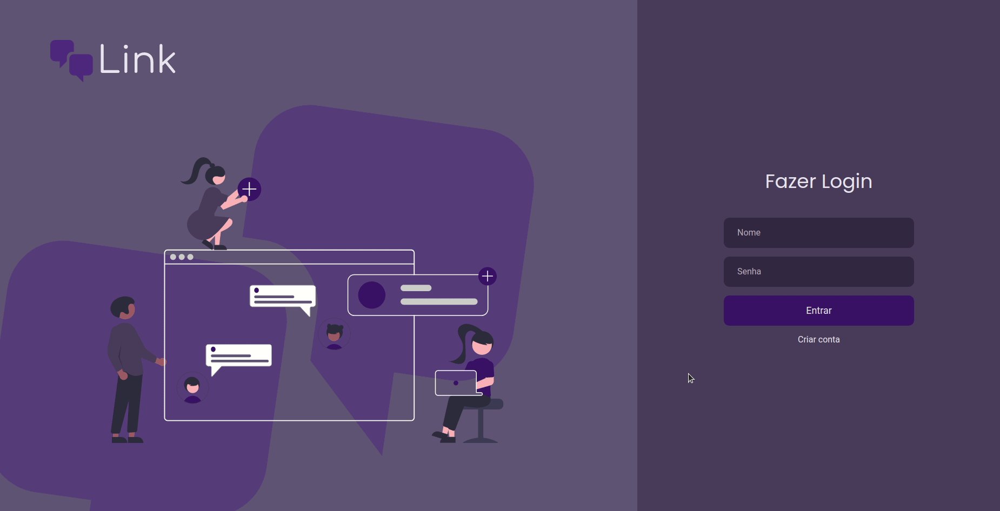

<h1 align="center">
    
</h1>

  <a href="https://frontend-link.herokuapp.com/">Link Website</a>&nbsp;&nbsp;&nbsp;|&nbsp;&nbsp;&nbsp;
  <a href="#question-about">About</a>&nbsp;&nbsp;&nbsp;|&nbsp;&nbsp;&nbsp;
  <a href="#gear-technologies">Technologies</a>&nbsp;&nbsp;&nbsp;|&nbsp;&nbsp;&nbsp;
  <a href="#getting-started">Getting Started</a>&nbsp;&nbsp;&nbsp;|&nbsp;&nbsp;&nbsp;
  <a href="#memo-license">License</a>

 

## User Registration/Login:

    

## Sending/Receiving messages:

---

  

## :question: About

A Realtime Chat Application to send and receive messages.

I developed this app to fix knowledge and learn new things like Websockets, GraphQL/Type-GraphQL, Apollo and authentication in these platforms. I also made a Figma template.

<a href="https://frontend-link.herokuapp.com/"> **"Link"** website here</a>  
<a href="https://www.figma.com/file/7eV2P820E5pT394ixBEdXJ/Link?node-id=0%3A1"> **"Link"** template here</a> 

## :gear: Technologies

**These are the technologies that I used to develop this application:**

⌨️ <strong>Typescript</strong> —> Extends JavaScript by adding types;  
⚙️ <strong>NodeJS</strong> —> A platform for building network applications; 
📊 <strong>GraphQL</strong> —> A query language for APIs; 
📊 <strong>Type-GraphQL</strong> —> GraphQL with types; 
📊 <strong>Apollo Server Express</strong> —> A spec-compliant GraphQL server; 
🌐 <strong>JSON Web Token</strong> —> Used to manage the tokens (Example: authentication); 
📚 <strong>Typeorm</strong> —> Used to manage databases; 
📚 <strong>Postgres</strong> —> Used to store users and messages; 
⚛️ <strong>ReactJS</strong> —> A JavaScript library for building user interfaces; 
💅 <strong>Styled-components</strong> —> Tagged template literals to style the components; 
📊 <strong>Apollo Client</strong> —> A comprehensive state management library with GraphQL; 
✅ <strong>Yup</strong> —> Used to validate forms; 
✅ <strong>Unform</strong> —> Used to create forms; 
 

 

# Getting Started

1. Clone this repo: `git clone https://github.com/erickivel/Link.git`
2. Move to the directory: `cd Link`

### Server
1. Move to the server directory: `cd server`
2. Run `yarn` or `npm install` to install the dependencies
3. Run `yarn dev:server` or `npm run dev:server` to start the server
4. The server runs on http://localhost:4000/graphql

### Web
1. Move to the web directory: `cd web`
2. Run `yarn` or `npm install` to install the dependencies
3. Run `yarn start` or `npm run start` to start the web application
4. The web application runs on http://localhost:3000

## :memo: License

This project is licensed under the **MIT License** - see the [LICENSE](LICENSE) file for details.
